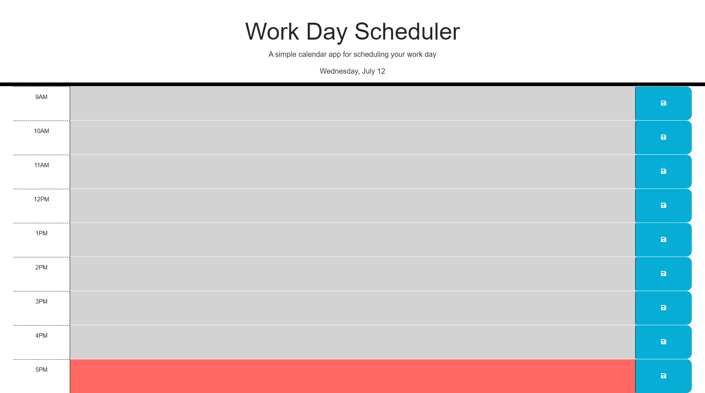

# Daily Planner

## Description

[This](https://jdperson.github.io/daily-planner/) page is a scheduling tool for users to add events/appointments/etc. to each hour of the standard business day which will be saved to localStorage upon clicking the blue save buttons. When viewing the page during business hours, each segment is colored based off the current time, using Day.js, to show if the hour has passed (gray), is coming up (green), or is the current hour (red).

